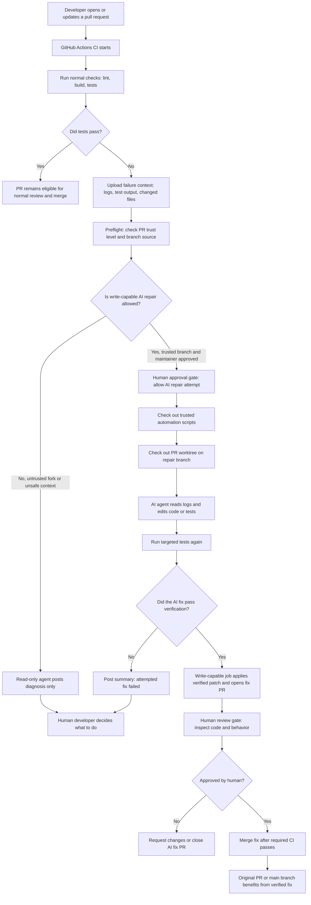

# Challenge One Codex Notes

Challenge one topic: GitHub Actions

## Q&A Log

### Question

ok, so my goal for the first challenge is to set up a basic GIthub action. what I am thinking could be a good one is a Lint check over the files. what do you think?

### Response

A lint check is a strong first GitHub Action because it is simple, useful, and shows an automated quality gate. For this repo, a lightweight quality check can cover JavaScript syntax with `node --check`, Python syntax with `python -m py_compile`, and Markdown linting if we add a Markdown linter. Since the existing Node apps did not start with lint scripts, starting with focused syntax/lint jobs is a clean first step.

### Question

ok I'm thinking we should break up the Lint checks into Multiple actions where it targets a specific thing, such as one that focuses on Markdown, one that focuses on python etc. whats your thoughts?

### Response

Breaking the checks up by target is a good idea, but it is better to start with separate jobs inside one workflow rather than separate workflow files. A single workflow can have jobs such as `markdown-lint`, `python-lint`, and `javascript-lint`, which gives clear pass/fail signals without duplicating too much YAML. Later, the checks can be split into separate workflows if they need different triggers.

### Question

ok. if we wanted github actions to later run the tests, would you put that in a seperate workflow or would you instead have a singular one that then runs one or more tests as a job?

### Response

Tests should go in the same workflow at first, as one or more separate jobs. A good structure would be a broader `ci.yml` workflow with jobs for Markdown linting, Python linting, JavaScript linting, and Node tests. Separate workflows make sense later if linting, tests, deploys, or scheduled checks need different triggers.

### Question

how would you describe what a job is?

### Response

A job is a named chunk of work inside a GitHub Actions workflow. Each job runs in its own environment and contains the steps needed to complete a task, such as checking out the code, installing dependencies, and running a Markdown lint, Python check, JavaScript check, or test command. Jobs can run independently, fail independently, and run in parallel by default unless configured with dependencies.

### Question

how do DevOps engineers normally document the design or "Current state" of CI/CD pipelines?

### Response

DevOps engineers usually document CI/CD pipelines in a short architecture or runbook-style document. The goal is to make the current automation understandable without requiring someone to reverse-engineer every workflow file.

Common sections include:

- Purpose: what the pipeline is meant to protect or automate.
- Triggers: when it runs, such as push, pull request, schedule, release, or manual dispatch.
- Workflow layout: which workflow files exist and what each one does.
- Jobs: the major units of work, such as linting, testing, building, security scanning, packaging, or deployment.
- Dependencies: required runtimes, package managers, secrets, tokens, containers, or external services.
- Environments: where code is deployed, such as dev, staging, or production.
- Gates: required checks, approvals, branch protections, or manual review points.
- Artifacts: build outputs, test reports, coverage reports, container images, or logs.
- Failure handling: common failure causes and where to look first when debugging.
- Ownership: who maintains the pipeline and who should be contacted when it breaks.

For this challenge, a good current-state note could describe the planned GitHub Actions workflow as a CI pipeline with separate jobs for Markdown checks, Python checks, JavaScript checks, and later tests.

### Question

when it comes to Cybersecurity, what are some example jobs people may run /methods people use to make sure that a project is secure?

### Response

Security checks in CI/CD are often grouped into separate jobs so each type of risk is easy to see and debug. Common examples include:

- Dependency scanning: checks third-party packages for known vulnerabilities. Examples include `npm audit`, Dependabot, GitHub dependency review, Snyk, or OWASP Dependency-Check.
- Secret scanning: looks for accidentally committed API keys, tokens, passwords, or private keys. Examples include GitHub secret scanning, Gitleaks, or TruffleHog.
- Static application security testing: scans source code for insecure patterns without running the app. Examples include CodeQL, Semgrep, SonarQube, or Bandit for Python.
- Container image scanning: checks Docker images for vulnerable operating system packages or unsafe image layers. Examples include Trivy, Grype, Docker Scout, or Anchore.
- Infrastructure-as-code scanning: checks Terraform, Kubernetes YAML, Dockerfiles, and cloud configs for risky settings. Examples include Checkov, tfsec, Terrascan, or Trivy config scanning.
- License compliance scanning: checks whether dependencies use licenses that are allowed by the project or company.
- Dynamic application security testing: runs security tests against a live app or test environment. Examples include OWASP ZAP baseline scans or authenticated web app scans.
- Permissions and workflow hardening: checks whether CI jobs use least-privilege tokens, pinned actions, protected environments, and required approvals.

For this challenge, the most realistic first security job would be dependency scanning or secret scanning because those are useful, easy to explain, and fit naturally into GitHub Actions.

### Question

so i know a common toolstack for CI/CD pipelines is Github actions and ArgoCD. what i want to know is when it comes to building CI/CD piplelines, whats considered a good baseline or best practice?

### Response

A good CI/CD baseline is usually built around one idea: every change should be validated automatically before it reaches users, and deployments should be repeatable, visible, and reversible.

For a GitHub Actions plus ArgoCD setup, a common best-practice split is:

- GitHub Actions handles CI: linting, testing, security checks, building artifacts, and publishing images.
- ArgoCD handles CD: watching Git for deployment manifests and syncing the desired state into Kubernetes.

Good baseline practices include:

- Run checks on pull requests: lint, tests, builds, and security checks should run before code is merged.
- Keep jobs separated by responsibility: examples include `markdown-lint`, `python-lint`, `javascript-lint`, `unit-tests`, `security-scan`, and `build-image`.
- Use branch protection: require important checks to pass before merging to the default branch.
- Build once, promote the same artifact: avoid rebuilding different artifacts for staging and production. Build an image once, tag it clearly, and promote that image through environments.
- Use Git as the source of truth: especially with ArgoCD, deployment state should come from version-controlled manifests or Helm/Kustomize config.
- Keep CI and CD credentials separate: CI may publish artifacts, while CD should have only the access needed to deploy.
- Use least-privilege permissions: GitHub Actions workflows should set narrow `permissions`, and secrets should be limited to jobs that need them.
- Pin important dependencies: pin action versions and runtime versions where practical so the pipeline is repeatable.
- Cache dependencies carefully: use caching to speed up builds, but avoid caching secrets or untrusted outputs.
- Add security checks early: dependency scanning, secret scanning, static code scanning, and container scanning are common baseline jobs.
- Make failures easy to debug: use clear job names, focused steps, readable logs, and uploaded reports when useful.
- Separate environments: use dev, staging, and production environments with different approvals or gates.
- Require production approval: production deployments often need a manual approval, protected environment, or release process.
- Support rollback: the team should know how to revert a deployment by rolling back Git state, image tags, or ArgoCD application history.
- Keep pipelines fast: the required PR checks should be useful but not painfully slow. Longer scans can run on schedule or before release.
- Document the current state: explain what workflows exist, what triggers them, what each job does, what secrets are required, and how to debug failures.

For this challenge repo, a strong baseline would start with a `ci.yml` workflow that runs separate jobs for Markdown checks, Python checks, JavaScript checks, and eventually tests/security scans. If the project later had a deployable Kubernetes app, ArgoCD would be introduced after CI builds and publishes a deployable artifact.

### Question

can you elaborate on "build once, Promote the same artifact" and how that applies to github workflows/actions?

### Response

"Build once, promote the same artifact" means the pipeline should create one deployable output and move that exact output through each environment instead of rebuilding it separately for dev, staging, and production.

An artifact can be:

- A Docker image.
- A packaged application file.
- A compiled binary.
- A static site build.
- A release bundle.

The reason this matters is that rebuilding for each environment can accidentally produce different outputs. A dependency version may change, a build script may behave differently, or a package registry may return something different. If staging tested one build but production receives a different build, the staging result is less trustworthy.

In GitHub Actions, a good pattern is:

- A CI workflow runs on pull requests and checks code quality.
- After merge to `main`, a build job creates the artifact once.
- The workflow tags or identifies that artifact clearly, often with the Git SHA.
- The workflow publishes it somewhere durable, such as GitHub Releases, GitHub Actions artifacts, GitHub Packages, or a container registry.
- Later deployment jobs or workflows deploy that same artifact to dev, staging, and production.

For Docker-based apps, this often looks like:

- Build image from commit `abc123`.
- Push image as `ghcr.io/org/app:abc123`.
- Optionally also tag it as `dev`, `staging`, or `prod`, but keep the immutable SHA tag as the real identity.
- Deploy `ghcr.io/org/app:abc123` to dev.
- Promote that exact image tag or digest to staging.
- Promote that exact image tag or digest to production.

In GitHub Actions, this can be modeled with separate jobs:

- `build`: checks out code, builds the artifact, and publishes it.
- `deploy-dev`: deploys the built artifact to dev.
- `deploy-staging`: deploys the same artifact after dev passes.
- `deploy-production`: deploys the same artifact after approval.

The jobs should pass around the artifact identity, such as an image tag, image digest, release version, or uploaded artifact name. They should not each rebuild from source.

With ArgoCD, GitHub Actions often builds and publishes the Docker image, then updates a deployment manifest or Helm values file with the image tag or digest. ArgoCD then sees that Git change and syncs the environment. Promotion means updating the next environment's manifest to point to the already-built image.

For this challenge repo, we probably do not need artifact promotion yet because the first workflow is focused on linting and checks. But if the project later adds deployment, GitHub Actions should build once, store the artifact identity, and have later jobs or workflows promote that same output instead of rebuilding it.

### Question

what are some ways that github actions could be used to help with administration or documentation that people dont typically think about?

### Response

GitHub Actions is often treated as a build/test/deploy tool, but it can also automate a lot of repository administration and documentation work. Good examples include:

- Documentation freshness checks: fail a pull request when code changes but related docs are not updated.
- Auto-generating documentation: build API docs, CLI docs, architecture diagrams, dependency lists, or configuration references from source files.
- Link checking: scan Markdown files for broken internal links, broken external links, missing anchors, or stale references.
- Table of contents updates: regenerate Markdown tables of contents automatically when docs change.
- Changelog generation: create or validate changelog entries from pull request labels, commit messages, or release notes.
- Release note drafting: collect merged pull requests since the last release and draft a release summary.
- Issue and pull request labeling: apply labels based on changed files, branch names, title patterns, or templates.
- Stale issue management: flag old issues or pull requests that need attention, while being careful not to close important work too aggressively.
- CODEOWNERS validation: check that changed areas have owners and that CODEOWNERS syntax is valid.
- Repository health checks: verify required files exist, such as `README.md`, `LICENSE`, `SECURITY.md`, `CONTRIBUTING.md`, or issue templates.
- Policy checks: enforce pull request title format, branch naming rules, signed commits, conventional commits, or required checklist items.
- Dependency inventory: periodically generate a list of dependencies, licenses, package versions, or outdated packages.
- Architecture decision record checks: require an ADR when certain high-impact files or infrastructure directories change.
- Screenshot or diagram updates: regenerate screenshots, Mermaid diagrams, OpenAPI docs, or static docs previews.
- Documentation preview deployments: publish a temporary docs preview for each pull request.
- Contributor onboarding checks: verify setup scripts, sample env files, and local development instructions still work.
- Workflow documentation: generate a summary of existing GitHub Actions workflows, triggers, jobs, and required secrets.
- Secret and environment inventory reminders: document which secrets are expected without exposing secret values.
- Scheduled audits: run weekly checks for stale dependencies, inactive workflows, unused labels, or missing branch protection assumptions.

For this challenge, a practical administration/documentation use of GitHub Actions could be a Markdown documentation check job. It could validate links, check formatting, and make sure key files like `README.md`, `Challenge_info.md`, and `agentic-launchpad-selection-submission.md` stay readable.

### Question

what are some other ways that github actions can be used to automate "mundane" tasks?

### Response

GitHub Actions is useful for automating repetitive maintenance work that people often forget, delay, or do inconsistently. Examples include:

- Formatting checks: run Prettier, Black, Ruff, or other formatters to confirm files follow the project style.
- Auto-format pull requests: commit formatting fixes back to a branch when safe to do so.
- Dependency update checks: regularly check for outdated packages and open issues or pull requests.
- Lockfile validation: make sure `package-lock.json`, `poetry.lock`, or similar files are updated when dependencies change.
- Version bumping: update package versions, changelogs, or release metadata after a release is approved.
- File generation: regenerate docs, schemas, API clients, type definitions, or configuration files.
- Template validation: make sure issue templates, pull request templates, and required checklist items are present.
- Pull request summaries: post a generated summary of changed files, test results, or deployment impact.
- Label cleanup: remove unused labels, sync label colors/descriptions, or apply labels based on file paths.
- Assignment reminders: notify reviewers when a pull request has been waiting too long.
- Stale branch detection: report branches that have not been updated in a long time.
- Scheduled backups: export issues, release metadata, package lists, or repository settings to a file or external storage.
- Environment drift checks: compare expected configuration against what is actually deployed or configured.
- License header checks: confirm source files include required notices.
- Generated asset checks: verify generated files are committed and up to date.
- README validation: run example commands from the README to ensure setup instructions still work.
- Broken link checks: scan documentation for dead links on a schedule.
- Spell checking: run a documentation spell checker against Markdown files.
- Size checks: warn when images, bundles, dependencies, or generated files get too large.
- Cleanup previews: delete old preview environments after pull requests close.
- Metrics collection: publish basic repository stats, test duration trends, or dependency counts.
- Notifications: send Slack, Teams, or email messages when important workflow events happen.

The best mundane automations are small, reliable, and easy to explain. A good rule is: if a task is repetitive, easy to forget, and has a clear pass/fail outcome, it is probably a good GitHub Actions candidate.

For this challenge, useful mundane tasks could include Markdown link checking, README validation, dependency audit checks, or a workflow that confirms required project files still exist.

### Question

how are AI agents being used in CI/github actions?

### Response

AI agents are increasingly being used in CI and GitHub Actions as helpers around review, diagnosis, documentation, and maintenance. They are usually most useful when they summarize context, explain failures, or propose changes, while the pipeline still uses deterministic checks for final pass/fail decisions.

Common uses include:

- Pull request summaries: read the diff and post a plain-English summary of what changed, why it matters, and which files are affected.
- Review assistance: flag risky changes, missing tests, confusing logic, or possible regressions before a human reviewer spends time on the pull request.
- CI failure triage: inspect failed job logs, identify the likely root cause, and suggest the next debugging step.
- Test failure explanation: summarize failing tests, expected vs. actual behavior, and likely related code.
- Suggested fixes: open a pull request or commit proposal that attempts to fix a failing lint, test, dependency, or documentation issue.
- Documentation updates: generate draft README updates, changelog entries, release notes, or API docs based on code changes.
- Security explanation: summarize vulnerability scan results in human-friendly language and suggest remediation paths.
- Dependency update help: explain what changed in a dependency update and whether the change looks risky.
- Issue routing: label issues, identify duplicates, suggest owners, or request missing reproduction details.
- Release note generation: summarize merged pull requests into user-facing release notes.
- Workflow maintenance: explain GitHub Actions failures, detect repeated flaky jobs, or suggest workflow simplifications.

Good guardrails are important:

- AI output should usually be advisory, not the only required check.
- Deterministic tools should still enforce pass/fail checks such as tests, linting, type checks, security scanners, and build steps.
- Agents should use limited permissions, especially when they can write comments, push commits, or open pull requests.
- Secrets should not be exposed to AI prompts or logs.
- Generated changes should go through normal review.
- The workflow should clearly show what the agent read, what it changed, and why.

In GitHub Actions, an AI-assisted workflow might run after tests fail, collect the logs, ask an agent to summarize the failure, and post the explanation as a pull request comment. A more advanced workflow might allow the agent to open a separate fix branch, but still require normal CI and human review before merging.

For this challenge, AI agents do not need to be part of the first workflow. A strong first step is still a clear CI workflow with lint jobs. Later, an AI helper could be added to summarize failed lint jobs or suggest documentation updates.

### Question

can you explain in more detail how a Github action workflow that uses AI agents to attempt fixes for failing tests would work? this seems awfully useful given the amount of code generation agents do.

### Response

A GitHub Actions workflow that uses an AI agent to attempt fixes for failing tests usually works as a second-stage automation. The normal test job still runs first. If tests fail, a separate AI-assisted job collects context, asks the agent to diagnose the failure, allows it to propose a patch, then validates that patch with the same tests.

A practical flow looks like this:

1. A pull request is opened or updated.
2. The normal CI workflow runs lint, build, and tests.
3. If the test job fails, GitHub Actions uploads logs, test output, and maybe coverage or failure reports as artifacts.
4. A follow-up job runs only on failure.
5. That job checks out the pull request branch or creates a new fix branch.
6. The job gives the AI agent limited context: failing test names, stack traces, relevant files, recent diff, package files, and project instructions.
7. The agent diagnoses the likely issue and edits the code or tests.
8. The workflow reruns the relevant tests.
9. If tests pass, the workflow commits the fix to a separate branch and opens a pull request, or comments with a patch suggestion.
10. A human reviews the AI-generated fix before it is merged.

The key idea is that the agent should not replace CI. The agent proposes a fix, but the deterministic checks still decide whether the code passes.

There are two common implementation models:

- Comment-only model: the agent analyzes the failure and posts a suggested fix as a pull request comment. This is safer because it does not write code directly.
- Fix-branch model: the agent creates a new branch, commits its attempted fix, opens a pull request, and lets normal CI plus human review decide whether it is acceptable.

A simplified GitHub Actions design could have jobs like:

- `test`: runs the normal test suite.
- `collect-failure-context`: runs only if `test` fails and saves logs, changed files, and failure details.
- `ai-diagnose-and-fix`: runs an agent with limited permissions and asks it to attempt a fix.
- `verify-ai-fix`: reruns the failing tests or full test suite against the attempted fix.
- `open-fix-pr`: opens a pull request only if the AI fix passes verification.

Important guardrails:

- Run the AI fix job only on trusted branches or with careful permission controls. Pull requests from forks are risky because they may contain malicious code.
- Use least-privilege GitHub token permissions. Only grant `contents: write` and `pull-requests: write` if the workflow truly needs to push a branch or open a PR.
- Do not expose secrets to the agent or to untrusted test code.
- Prefer opening a separate fix PR instead of pushing directly to the user's branch.
- Require normal CI to pass on the AI-generated fix.
- Require human review before merging.
- Limit the scope of files the agent can edit when possible.
- Keep the agent prompt grounded in logs and repository instructions.
- Save the agent's reasoning summary, changed files, and test results so reviewers can understand what happened.
- Add loop limits. For example, allow only one or two fix attempts so the workflow does not run forever or burn unnecessary compute.

For example, a failing-test repair workflow might be triggered by `workflow_run` after the normal CI workflow fails. It could download test logs, run an agent command such as `codex fix failing tests`, rerun `npm test`, and then use a GitHub action such as `peter-evans/create-pull-request` to open a PR with the result.

For code generation-heavy projects, this can be very useful because many failures are small integration mistakes: missing imports, outdated snapshots, incorrect assumptions about a function signature, or test fixtures that no longer match the implementation. The AI agent can often produce a reasonable first fix faster than a human can read all the logs.

The risk is that an agent may "fix" the test by weakening it or changing expected behavior incorrectly. That is why the best practice is to make AI-generated fixes visible, isolated, and review-gated. The workflow should help the developer, not silently decide what the product should do.

For this challenge repo, this idea is probably too advanced for the first GitHub Action implementation. But it would be a strong future enhancement after the baseline CI workflow exists, especially because one app already has failing tests that could be used to demonstrate AI-assisted test failure triage.

### Question

i'm quite interested in the idea of using AI agents to automate failing tests. in order for me to visualise the workflow better, can you show me a mermaid diagram of how it would flow? embeed this in the Codex Notes doc and explain whats happening at each step/job, show example code and explain it to a target audiance that is just learning how gitops/github actions work. obviously we need human approval gates in the right places, but i want you to justify why a human needs to review something VS an agent/automation script.

### Response

Below is a beginner-friendly design for a GitHub Actions workflow that uses an AI agent to help fix failing tests.

The important idea is that the AI agent does not replace CI and does not get to merge its own work. The agent acts like an automated junior helper: it reads the failure, tries a fix, proves the fix by rerunning tests, and then asks a human to review the result.

#### Mermaid Diagram



#### What Is Happening At Each Stage?

1. Developer opens or updates a pull request.

This is the normal starting point. Someone proposes a code change. GitHub Actions reacts to that event.

2. GitHub Actions runs normal CI.

CI means "continuous integration." It is the automated checking layer for the project. In a normal workflow, this might include linting, tests, build checks, and security scans.

3. CI decides whether tests passed.

If the tests pass, nothing special happens. The pull request continues through the normal human review process. If the tests fail, the AI repair path becomes available.

4. The workflow uploads failure context.

The AI agent needs useful context. This can include:

- Test logs.
- Stack traces.
- Names of failing tests.
- The pull request diff.
- Relevant source files.
- Package files like `package.json`.
- Project instructions such as `README.md` or `Agents.md`.

5. A preflight job checks whether AI repair is allowed.

This is a safety decision. A pull request from a fork or unknown contributor might contain malicious code. In that case, the safest option is for the AI to only post a diagnosis. The workflow should not give write permissions, secrets, or trusted automation privileges to untrusted code.

The preflight job should check things like:

- Whether the pull request comes from the same repository or from a fork.
- The author's relationship to the repository.
- The base branch and target branch.
- Whether the branch is already an AI-generated branch such as `ai/*`.
- Whether a maintainer explicitly requested the AI repair.

6. Untrusted changes get diagnosis-only mode.

Diagnosis-only mode means the AI can summarize the failure and suggest next steps, but it cannot push commits or open a repair branch. This keeps the workflow helpful without giving write access to unsafe code.

7. Human approval gate before the AI repair attempt.

If the AI agent is going to use AI secrets, spend AI budget, or generate an automated repair patch, a human maintainer should approve that action first. This can be done with a manual `workflow_dispatch` trigger, a comment command like `/ai-repair`, or a protected GitHub Environment that requires approval before the AI job runs.

8. The workflow checks out trusted automation separately from the pull request.

This is important. A privileged job should not run scripts that came from the pull request branch. Instead, the workflow should run the agent orchestration script from a trusted branch, pinned action, or separate automation repository. The pull request code should be treated as the worktree to inspect and edit, not as the source of the workflow's trusted logic.

9. AI agent attempts the fix in a separate worktree.

The agent reads the logs and relevant files, then edits code or tests in a separate worktree and produces a patch. The goal is not to "make the error disappear" at any cost. The goal is to make the implementation and tests agree with the intended behavior.

10. GitHub Actions verifies the attempted fix.

After the agent edits files, the workflow reruns the relevant tests. This is the deterministic part. The agent can suggest a fix, but the test command decides whether the fix actually works.

11. If verification fails, the workflow does not open a fix PR.

The agent posts a summary of what it tried and why it failed. This still helps the human developer because the failure has been triaged.

12. If verification passes, the workflow opens a fix pull request.

The agent-created changes should be isolated in their own branch and pull request. This step needs write permissions because it applies the verified patch, pushes a repair branch, and opens a pull request. This makes the AI's work visible and reviewable.

13. Human review gate before merge.

Even if tests pass, a human still needs to review the AI-generated fix. Tests prove that known checks passed. They do not prove that the change is correct, secure, maintainable, or aligned with product intent.

#### Why Humans Still Need To Review

Automation is excellent at repeatable checks. Humans are still needed for judgment.

Tasks that automation can usually handle:

- Running tests.
- Running lint checks.
- Collecting logs.
- Detecting which test failed.
- Creating a branch.
- Opening a pull request.
- Rerunning verification commands.
- Blocking merge when required checks fail.

Tasks that need human review:

- Deciding whether the test or the implementation is wrong.
- Checking whether the AI weakened a test just to make it pass.
- Confirming the fix matches the intended product behavior.
- Reviewing security implications.
- Confirming the code is maintainable and understandable.
- Deciding whether the change belongs in the current pull request.
- Approving changes that affect production behavior or user data.

The simplest way to say it is: automation can prove that commands passed, but humans decide whether the change is the right change.

#### Example GitHub Actions Workflow

This is a conceptual example. The exact agent command would depend on the AI tool being used. The important pattern is the job structure, permissions, failure handling, verification, and human approval gates.

```yaml
name: AI Test Repair

on:
  workflow_dispatch:
    inputs:
      pr_number:
        description: "Pull request number to investigate"
        required: true

permissions:
  contents: read
  pull-requests: read

jobs:
  preflight:
    name: Check whether AI repair is allowed
    runs-on: ubuntu-latest

    outputs:
      allow_repair: ${{ steps.check.outputs.allow_repair }}
      target_branch: ${{ steps.check.outputs.target_branch }}
      base_branch: ${{ steps.check.outputs.base_branch }}

    steps:
      - name: Inspect pull request trust level
        id: check
        env:
          GH_TOKEN: ${{ github.token }}
        run: |
          gh pr view "${{ inputs.pr_number }}" \
            --json headRefName,baseRefName,isCrossRepository,authorAssociation \
            > pr.json

          TARGET_BRANCH="$(jq -r '.headRefName' pr.json)"
          BASE_BRANCH="$(jq -r '.baseRefName' pr.json)"
          IS_CROSS_REPO="$(jq -r '.isCrossRepository' pr.json)"
          AUTHOR_ASSOCIATION="$(jq -r '.authorAssociation' pr.json)"

          ALLOW_REPAIR="false"

          if [[ "$IS_CROSS_REPO" == "false" ]] &&
             [[ "$AUTHOR_ASSOCIATION" =~ ^(OWNER|MEMBER|COLLABORATOR)$ ]] &&
             [[ "$TARGET_BRANCH" != ai/* ]]; then
            ALLOW_REPAIR="true"
          fi

          echo "allow_repair=$ALLOW_REPAIR" >> "$GITHUB_OUTPUT"
          echo "target_branch=$TARGET_BRANCH" >> "$GITHUB_OUTPUT"
          echo "base_branch=$BASE_BRANCH" >> "$GITHUB_OUTPUT"

  collect-context:
    name: Collect failure context
    needs: preflight
    runs-on: ubuntu-latest

    steps:
      - name: Check out pull request worktree
        uses: actions/checkout@v4
        with:
          ref: refs/pull/${{ inputs.pr_number }}/head
          path: worktree
          fetch-depth: 0

      - name: Capture repository context
        env:
          BASE_BRANCH: ${{ needs.preflight.outputs.base_branch }}
        run: |
          mkdir -p ai-context
          cd worktree
          git fetch origin "$BASE_BRANCH:refs/remotes/origin/$BASE_BRANCH" --depth=1
          git status --short > ../ai-context/git-status.txt
          git diff --stat "origin/$BASE_BRANCH"...HEAD > ../ai-context/diff-stat.txt
          find . -maxdepth 3 -type f \
            \( -name "package.json" -o -name "README.md" -o -name "Agents.md" \) \
            > ../ai-context/project-files.txt

      - name: Capture failing test output
        continue-on-error: true
        run: |
          cd worktree/launchpad-failing-tests-app/failing-tests-app
          npm ci
          npm test 2>&1 | tee ../../../ai-context/test-output.log

      - name: Upload context
        uses: actions/upload-artifact@v4
        with:
          name: ai-repair-context
          path: ai-context/

  agent-repair:
    name: Generate and verify AI repair patch
    needs:
      - preflight
      - collect-context
    if: needs.preflight.outputs.allow_repair == 'true'
    runs-on: ubuntu-latest

    # Configure this environment in GitHub so a maintainer must approve the
    # AI repair attempt before the job can use AI secrets or spend AI budget.
    environment: ai-repair

    permissions:
      contents: read
      pull-requests: read

    steps:
      - name: Check out trusted automation
        uses: actions/checkout@v4
        with:
          ref: main
          path: trusted

      - name: Check out pull request worktree
        uses: actions/checkout@v4
        with:
          ref: refs/pull/${{ inputs.pr_number }}/head
          path: worktree
          fetch-depth: 0

      - name: Download context
        uses: actions/download-artifact@v4
        with:
          name: ai-repair-context
          path: ai-context/

      - name: Install dependencies
        run: |
          cd worktree/launchpad-failing-tests-app/failing-tests-app
          npm ci

      - name: Ask AI agent to attempt a fix
        env:
          # Example only. Store the real key as an environment secret.
          AI_API_KEY: ${{ secrets.AI_API_KEY }}
        run: |
          trusted/scripts/ai-repair-tests.sh \
            --repo worktree \
            --context ai-context \
            --test-command "cd launchpad-failing-tests-app/failing-tests-app && npm test"

      - name: Verify attempted fix
        run: |
          cd worktree/launchpad-failing-tests-app/failing-tests-app
          npm test

      - name: Create patch artifact
        run: |
          cd worktree
          if git diff --quiet; then
            echo "The AI agent did not produce any file changes."
            exit 1
          fi
          git diff > ../ai-fix.patch

      - name: Upload verified patch
        uses: actions/upload-artifact@v4
        with:
          name: ai-fix-patch
          path: ai-fix.patch

  open-fix-pr:
    name: Open AI fix pull request
    needs:
      - preflight
      - agent-repair
    runs-on: ubuntu-latest

    # Optional second approval gate for the write-capable job.
    environment: ai-open-fix-pr

    permissions:
      contents: write
      pull-requests: write

    steps:
      - name: Check out target branch
        uses: actions/checkout@v4
        with:
          ref: ${{ needs.preflight.outputs.target_branch }}
          fetch-depth: 0

      - name: Download verified patch
        uses: actions/download-artifact@v4
        with:
          name: ai-fix-patch
          path: .

      - name: Apply patch and push repair branch
        env:
          REPAIR_BRANCH: ai/fix-failing-tests-${{ github.run_id }}
        run: |
          git switch -c "$REPAIR_BRANCH"
          git apply ai-fix.patch
          rm ai-fix.patch

          git config user.name "github-actions[bot]"
          git config user.email "github-actions[bot]@users.noreply.github.com"
          git add launchpad-failing-tests-app/failing-tests-app
          git commit -m "Attempt AI repair for failing tests"
          git push --set-upstream origin "$REPAIR_BRANCH"
          echo "REPAIR_BRANCH=$REPAIR_BRANCH" >> "$GITHUB_ENV"

      - name: Open pull request for human review
        env:
          GH_TOKEN: ${{ github.token }}
        run: |
          cat > ai-fix-pr-body.md <<'BODY'
            This pull request was generated by an AI-assisted repair workflow.

            A human reviewer should verify:
            - The failing behavior is fixed for the right reason.
            - Tests were not weakened just to make CI pass.
            - The implementation still matches expected product behavior.
            - The change is secure and maintainable.
          BODY

          gh pr create \
            --base "${{ needs.preflight.outputs.target_branch }}" \
            --head "$REPAIR_BRANCH" \
            --title "AI repair attempt for failing tests" \
            --body-file ai-fix-pr-body.md
```

#### Explaining The Example For A Beginner

`workflow_dispatch` means the workflow is started manually. That is useful for this kind of automation because a maintainer can decide when it is safe to let the agent attempt a write operation.

`permissions` controls what the workflow is allowed to do. The top-level workflow starts with read-only permissions. The only job with write permissions is `open-fix-pr`, and that job does not run the tests or the AI tool. It only applies a verified patch and opens a pull request.

`preflight` checks whether the pull request is eligible for AI repair. It blocks unsafe situations such as forked pull requests, unknown contributors, or branches that already look AI-generated.

`collect-context` gathers information for the agent. It captures the diff summary and actual failing test output, which keeps the agent grounded in real evidence instead of guessing.

`environment: ai-repair` represents a human approval gate. In GitHub, environments can be configured so a reviewer must approve the job before it continues. This is useful because the job may use AI secrets or spend AI budget.

`agent-repair` is where the agent would run. It checks out trusted automation from `main` into one folder and the pull request worktree into another folder. This avoids running a repair script supplied by the pull request itself.

`Verify attempted fix` reruns the failing tests. This is important because the agent's confidence is not enough. The workflow needs a real command to pass.

`Create patch artifact` stores the verified AI change as a patch file. This lets the workflow pass the change to a later job without giving the test-running job write permissions.

`open-fix-pr` is the only write-capable job. It can have its own protected environment, such as `ai-open-fix-pr`, so maintainers approve the step that actually pushes a branch and opens a pull request. The agent should not merge directly. The pull request gives humans a normal place to review the diff, ask questions, and approve or reject the change.

#### How This Connects To GitOps

GitOps means Git is treated as the source of truth. Automation should propose changes to Git, and other systems react to those reviewed changes.

For AI test repair, the GitOps-friendly pattern is:

- The agent does not directly mutate production or main silently.
- The agent creates a branch.
- The branch becomes a pull request.
- Humans and CI review the pull request.
- Only merged Git changes become accepted project state.

That keeps the workflow auditable. You can always answer:

- What changed?
- Who or what proposed it?
- Which tests ran?
- Who approved it?
- When was it merged?

#### Best-Practice Summary

For an AI test repair workflow, a strong baseline is:

- Let normal CI fail first.
- Collect logs and context automatically.
- Add a preflight job that checks whether repair is safe to attempt.
- Allow diagnosis-only mode for untrusted pull requests.
- Require human approval before the agent uses AI secrets or repair automation.
- Run trusted repair scripts from a trusted branch or automation repository.
- Keep PR-controlled code away from write-capable tokens.
- Have the agent produce a patch from a separate worktree.
- Rerun tests after the agent changes files.
- Open a pull request only if verification passes.
- Require human code review before merge.
- Keep all actions auditable in GitHub.

This makes the AI agent useful without letting it become the final authority. The agent accelerates investigation and proposes a fix; GitHub Actions verifies the fix; humans decide whether the fix should become part of the project.
